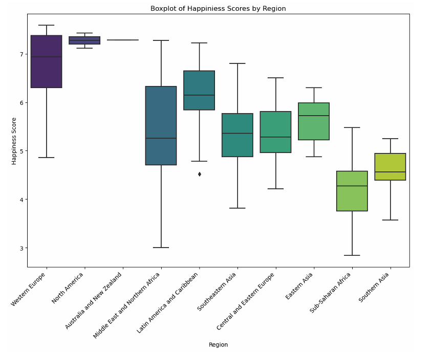

# GDP & Happiness Analysis

This project explores how GDP and other quality of life indicators relate to happiness scores across global regions, using data from the World Happiness Report and the Global Open Data Index. The goal is to identify key factors that influence happiness and to build a regression model that quantifies their impact.

## My Contributions

- Led the entire analysis process, including data cleaning, visualization, and regression modeling  
- Explored the relationship between happiness scores and quality-of-life indicators such as GDP, family support, health, and freedom across global regions  
- Built and evaluated both simple and multiple linear regression models to assess variable importance  
- Visualized results to identify regional patterns and interpret correlations between variables

## Dataset

Two primary datasets were used:
- **World Happiness Report (2015)**: Includes happiness scores and contributing factors such as GDP per capita, family support, health (life expectancy), freedom, trust in government, and generosity for 158 countries.
- **Global Open Data Index (2015)**: Measures openness of government data across countries.

After merging the datasets, 118 countries with complete information were included in the analysis.

## Data Preparation

- Renamed and selected relevant variables from both datasets
- Merged data on country names
- Grouped countries into regions for regional comparison
- Created region-level indicators for GDP, health, freedom, family support, and openness
- Sorted and visualized data to identify patterns

## Analysis

1. **Visualization**
   - Box plots, violin plots, and density plots were used to compare distributions of happiness and indicators across regions
   - Scatterplots and pairplots revealed positive correlations between happiness and indicators such as GDP, health, freedom, and family support

2. **Correlation**
   - GDP showed the strongest correlation with happiness score (r ≈ 0.8)
   - Openness showed a weaker but still positive correlation (r ≈ 0.49)

3. **Modeling**
   - Built simple linear regression models for each individual indicator
   - Constructed a multiple linear regression model using GDP, family, and health as predictors
   - The final model achieved an R² of **0.73** and **RMSE = 0.57**, indicating strong explanatory power

## Key Findings

- GDP per capita, family support, and health (life expectancy) are the most significant predictors of happiness
- Freedom and openness contribute positively but are less impactful
- Western Europe and North America show consistently high happiness and indicator scores, while Sub-Saharan Africa shows lower scores and greater variability

## Visualizations

### 1. Relationship between GDP and Happiness
This scatter plot shows a strong positive correlation between GDP per capita and happiness scores. A regression line is added to highlight the trend.

### 2. Distribution of Happiness Scores by Region
This box plot compares happiness scores across global regions. Western Europe and North America tend to show higher scores, while Sub-Saharan Africa shows lower scores with greater variability.

### 3. Correlation Matrix of Key Indicators
This heatmap illustrates the correlation between happiness and various quality of life indicators. GDP, family support, and health show the strongest positive correlations with happiness.

## Tools Used

- Language: Python  
- Libraries: pandas, matplotlib, seaborn, scikit-learn
